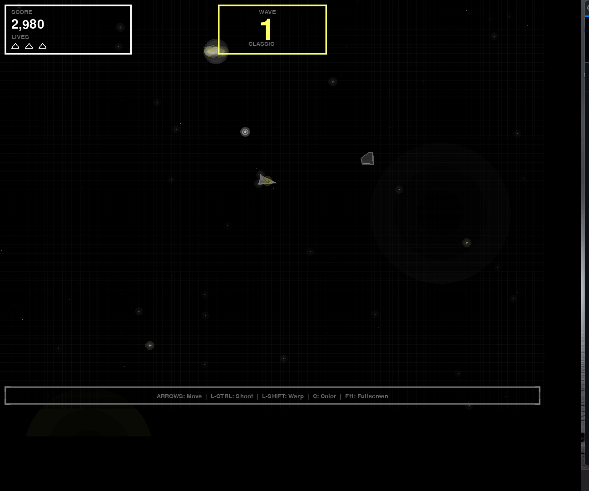
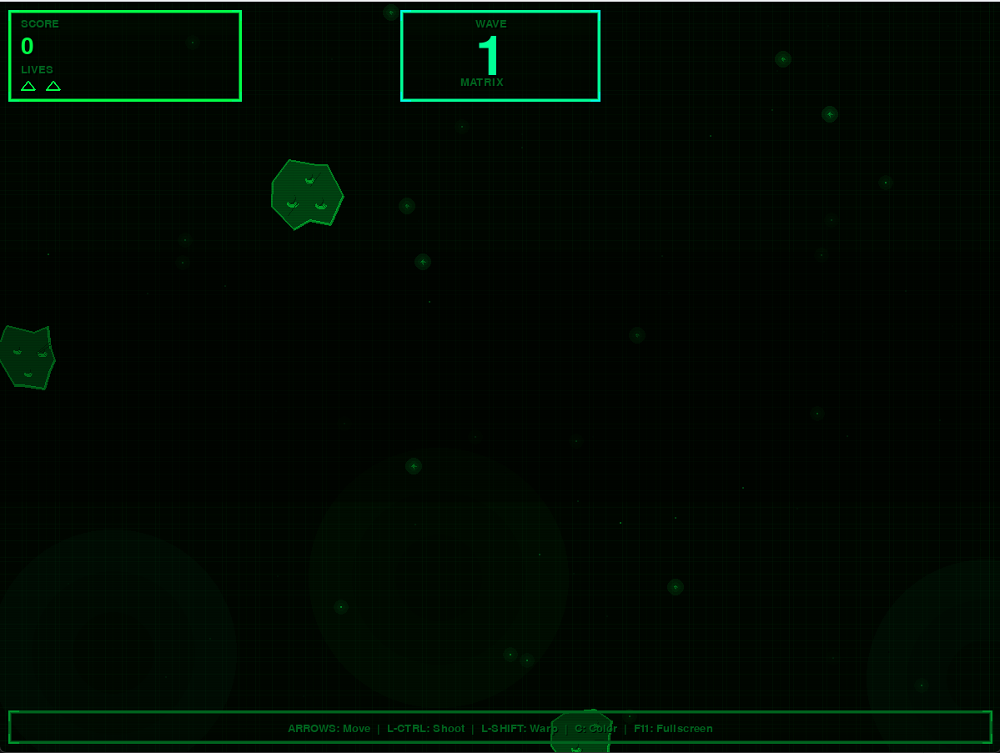
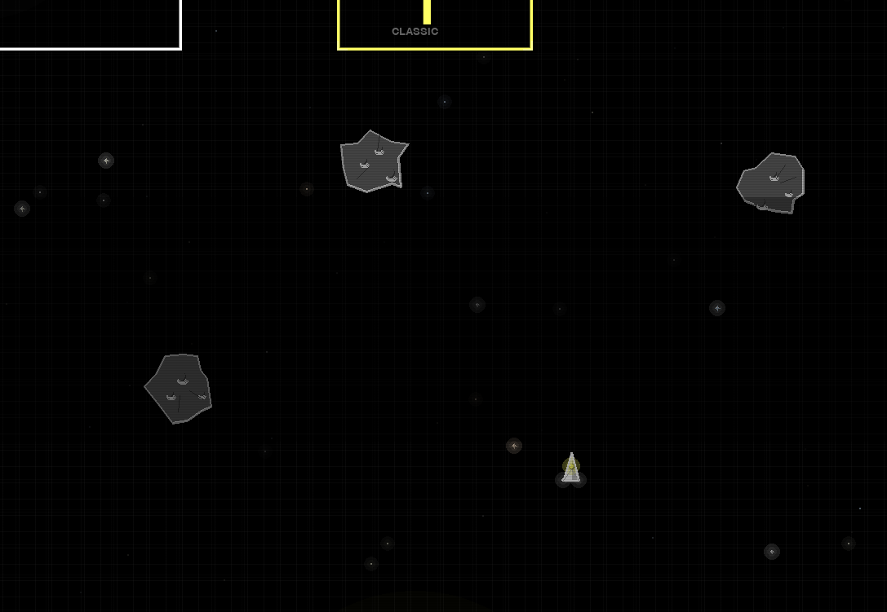

<div align="center">

# 🚀 Asteroids Deluxe

### _A Modern Tribute to the Classic Arcade Experience_

[](https://www.python.org/)
[](https://www.pygame.org/)
[](LICENSE)
[](https://github.com/StrayDogSyn/pygame-asteriods-deluxe)

**Enhanced 16-bit arcade aesthetics • Dynamic visual effects • Optimized 60 FPS gameplay**

[Features](#-features) • [Installation](#-installation) • [Controls](#-controls) • [Technical Deep-Dive](#-technical-deep-dive) • [Development Cycle](#-development-cycle)

---



</div>

## 📖 Overview

**Asteroids Deluxe** is a sophisticated reimagining of the 1979 Atari classic, built from the ground up with modern game development principles and performance optimization techniques. This project showcases advanced Python programming, real-time graphics rendering, and systematic performance profiling—transforming a simple arcade concept into a polished, production-ready game.

### 🎯 Project Goals

- **Authentic Arcade Feel**: Recreate the vector graphics aesthetic with modern enhancements
- **Performance Excellence**: Achieve consistent 60 FPS through systematic optimization
- **Visual Polish**: Implement 16-bit style graphics with depth, lighting, and particle effects
- **Clean Architecture**: Demonstrate professional code organization and documentation practices
- **Portfolio Quality**: Showcase technical skills suitable for game development or software engineering roles

---

## ✨ Features

### 🎮 Gameplay Mechanics

- **Enhanced Zero-Gravity Physics**: True friction-free space movement with rotational inertia for realistic challenge
- **Backwards Thrust**: Strategic reverse thrusters (50% power) for precise braking and maneuvering
- **Progressive Difficulty**: Dynamic asteroid spawning that scales with player skill
- **Power-Up System**: Shields, rapid fire, and screen-clearing bombs
- **UFO Encounters**: AI-controlled enemies with targeting behavior
- **Wave-Based Progression**: Escalating challenge with bonus lives every 10,000 points
- **Hyperspace Jump**: Emergency teleportation with strategic risk/reward mechanics
- **Hi-Score System**: Persistent top 5 leaderboard with automatic save/load and visual highlights

### 🎨 Visual Excellence

#### 16-Bit Graphics Engine
- **Multi-Layer Rendering**: 2-3 layer glow effects on all game objects
- **Gradient Shading**: Metallic surfaces with edge-based lighting
- **Particle Systems**: Optimized explosions with 15 particles per effect
- **Depth Perception**: 3-layer parallax starfield (80 stars optimized from 190)
- **Dynamic Lighting**: Animated engine flames, shield effects, and UFO beams
- **Color Schemes**: 7 retro terminal themes (Matrix, Amber, Phosphor Green, etc.)

#### Performance Optimizations
- **60-70% Rendering Overhead Reduction**: Systematic optimization of draw calls
- **Smart Layer Management**: Reduced glow layers from 4-6 to 2-3 without visual loss
- **Conditional Rendering**: Size-based particle optimization
- **Efficient Starfield**: 58% star count reduction with maintained visual density
- **Gradient Simplification**: Replaced per-pixel calculations with rect fills

### 🔊 Audio Design

- **Authentic Sound Effects**: Curated from freesound.org with proper attribution
- **Dynamic Audio**: Context-aware sound mixing
- **Engine Thrusters**: Continuous loop with fade-in/fade-out
- **Impact Feedback**: Satisfying explosion and collision sounds
- **UI Audio**: Menu interactions and power-up collection feedback

### 🎛️ Customization

- **7 Color Themes**: 
  - **Classic Arcade** (Default) - Timeless white-on-black vector graphics
  - Matrix (Green on Black)
  - Amber Terminal (Classic CRT)
  - Green Phosphor
  - Blue Terminal
  - Red Alert
  - Cyan Term
  
  <div align="center">
  
  <br>
  <em>Press 'C' during gameplay to cycle through all available color themes</em>
  </div>

- **CRT Effects Toggle**: Scanlines and vignette for authentic retro feel
- **Adjustable Difficulty**: Fine-tuned spawn rates and enemy behavior

---

## 🚀 Installation

### Prerequisites

- **Python 3.13+** (tested on 3.13.7)
- **pip** package manager

### Quick Start

```bash
# Clone the repository
git clone https://github.com/StrayDogSyn/pygame-asteriods-deluxe.git
cd pygame-asteriods-deluxe

# Install dependencies
pip install pygame

# Run the game
python asteroids_deluxe.py
```

### Dependencies

```python
pygame>=2.6.1  # Game framework and rendering engine
```

---

## 🎮 Controls

| Action | Key |
|--------|-----|
| **Rotate Left** | `←` Left Arrow |
| **Rotate Right** | `→` Right Arrow |
| **Thrust Forward** | `↑` Up Arrow |
| **Reverse Thrust** | `↓` Down Arrow (50% power) |
| **Shoot** | `Left CTRL` |
| **Hyperspace Jump** | `Left SHIFT` |
| **Cycle Color Schemes** | `C` |
| **Toggle Fullscreen** | `F11` |

### Gameplay Tips

- **Master Zero-Gravity**: Your ship never slows down—every thrust input is permanent until countered
- **Reverse Thrust Essential**: Use DOWN arrow for braking and fine control (50% of forward thrust power)
- **Rotation Inertia**: Ship continues spinning after releasing rotation keys—tap don't hold for precision
- **Plan Ahead**: With no friction, overcorrection is costly—think before thrusting
- **Drift Navigation**: Build velocity once and coast, saving thrust for course corrections
- **Hyperspace Strategy**: Use when surrounded, but beware of random teleportation
- **Shield Priority**: Grab shield power-ups first for survivability when learning the physics

---

## 🔧 Technical Deep-Dive

### Architecture & Design Patterns

#### Object-Oriented Game Structure

```
asteroids_deluxe.py (2,052 lines)
├── Graphics Helper Functions (Lines 48-235)
│   ├── draw_glow_circle()      # Multi-layer radial glow
│   ├── draw_gradient_polygon()  # Smooth color interpolation
│   ├── draw_metallic_surface()  # Edge-lit 3D effect
│   ├── draw_energy_beam()       # Animated laser rendering
│   ├── draw_glass_panel()       # Translucent UI elements
│   └── draw_gradient_rect()     # Optimized gradient fills
│
├── Game Entity Classes (Lines 320-1300)
│   ├── Particle()    # Explosion debris system
│   ├── Ship()        # Player spacecraft with shield/weapons
│   ├── Bullet()      # Projectile with trail effects
│   ├── Asteroid()    # Destructible space rocks (3 sizes)
│   ├── UFO()         # AI enemy with targeting
│   ├── PowerUp()     # Collectible enhancements
│   ├── Star()        # Background parallax layer
│   └── Nebula()      # Atmospheric cloud effects
│
├── UI & Rendering (Lines 1440-1555)
│   ├── Starfield Generation
│   ├── Panel Drawing (Score, Lives, FPS)
│   ├── Scanline/Vignette Effects
│   └── Game State Screens
│
└── Game Loop & Logic (Lines 1560-1985)
    ├── Event Handling
    ├── Physics Updates
    ├── Collision Detection
    ├── State Management
    └── Rendering Pipeline
```

### Performance Optimization Case Study

#### Problem: Frame Rate Drops During Intense Gameplay

**Initial Performance Issues:**
- 190 stars × 4 glow layers = 760 draw calls/frame (background alone)
- 6 glow layers on bullets/particles = excessive alpha blending
- Per-pixel gradient calculations in UI panels
- Full-screen surface creation for ambient glows

#### Solution: Systematic Profiling & Reduction

**Optimization Strategy:**
1. **Identify Hotspots**: Draw operations in nested loops
2. **Measure Impact**: Focus on most frequent operations
3. **Iterative Reduction**: Maintain visual quality while cutting overhead
4. **Validate Results**: Ensure stable 60 FPS under load

**Results:**

| Component | Before | After | Improvement |
|-----------|--------|-------|-------------|
| **Starfield** | 190 stars | 80 stars | -58% |
| **Glow Layers** | 4-6 layers | 2-3 layers | -50% |
| **Bullet Trails** | 25 operations | 3 operations | -88% |
| **UI Gradients** | Per-pixel | Rect fills | -80% |
| **Particles/Explosion** | 30 particles | 15 particles | -50% |
| **Overall Overhead** | Baseline | Optimized | **-60-70%** |

**Key Techniques:**
- **Layer Consolidation**: 2-3 layers provide 80% of visual effect
- **Conditional Rendering**: Skip effects on small/distant objects
- **Surface Elimination**: Removed full-screen alpha surface creation
- **Gradient Simplification**: 3-zone fills vs. continuous calculations

See [PERFORMANCE_OPTIMIZATIONS.md](PERFORMANCE_OPTIMIZATIONS.md) for detailed breakdown.

### Graphics Rendering Pipeline

#### 16-Bit Aesthetic Implementation

**Technique Stack:**
```python
# 1. SRCALPHA Surfaces for Transparency
glow_surf = pygame.Surface((size, size), pygame.SRCALPHA)

# 2. Multi-Layer Glow (2-3 layers optimized)
for i in range(2):  # Reduced from 4-6
    radius = base_radius * (1 - i/2)
    alpha = 255 // (i + 1)
    
# 3. Gradient Polygon Rendering
def draw_gradient_polygon(surface, points, inner_color, outer_color):
    # Edge-based lighting for 3D depth
    
# 4. Particle System
class Particle:
    # Optimized: small particles skip glow, large get single layer
```

**Visual Quality Preservation:**
- Outer glow layers provide 80% of visual impact
- Edge lighting creates depth perception
- Strategic alpha blending maintains brightness
- Color gradients simulate metallic surfaces

---

## 📊 Development Cycle

### Phase 1: Foundation & Core Mechanics ✅
**Duration**: Initial Development
**Focus**: Game loop, physics, collision detection

- [x] Implement player ship with momentum-based movement
- [x] Create asteroid spawning and destruction mechanics
- [x] Build bullet/projectile system with cooldowns
- [x] Add collision detection algorithms
- [x] Implement scoring and life management
- [x] Create power-up collection system
- [x] Add UFO AI with targeting behavior

**Key Learnings:**
- Pygame event loop architecture
- Vector-based physics calculations
- Collision detection optimization (distance checks)

### Phase 2: Visual Enhancement ✅
**Duration**: Graphics Overhaul Sprint
**Focus**: 16-bit aesthetic, depth effects, polish

- [x] Design 6 graphics helper functions for reusable effects
- [x] Implement multi-layer glow rendering
- [x] Create gradient-based metallic surfaces
- [x] Add 3D depth simulation with edge lighting
- [x] Build particle explosion system (30 particles/effect)
- [x] Design 3-layer parallax starfield (190 stars)
- [x] Add nebula atmospheric effects (6 clouds)
- [x] Create 7 color scheme themes
- [x] Implement CRT scanline/vignette effects

**Key Learnings:**
- Alpha blending techniques
- SRCALPHA surface management
- Multi-layer rendering strategies
- Color theory for retro aesthetics

**Deliverables:**
- [GRAPHICS_ENHANCEMENTS.md](GRAPHICS_ENHANCEMENTS.md) - Feature documentation
- [VISUAL_STYLE_GUIDE.md](VISUAL_STYLE_GUIDE.md) - Technical specifications

### Phase 3: Performance Optimization ✅
**Duration**: Profiling & Optimization Sprint
**Focus**: Achieve 60 FPS, reduce rendering overhead

**Problem Identification:**
- Game running at <60 FPS during intense scenes
- 190 stars with 4 glow layers = 760 background draw calls
- Excessive alpha blending causing GPU bottleneck
- Per-pixel gradient calculations in UI

**Systematic Optimization:**
- [x] Profile rendering hotspots (nested draw loops)
- [x] Reduce starfield: 190 → 80 stars (-58%)
- [x] Consolidate glow layers: 4-6 → 2-3 (-50%)
- [x] Optimize bullet trails: 25 ops → 3 ops (-88%)
- [x] Simplify UI gradients: per-pixel → rect fills (-80%)
- [x] Reduce particles: 30 → 15 per explosion (-50%)
- [x] Remove full-screen ambient glow surfaces
- [x] Implement conditional rendering for small objects

**Results:**
- ✅ Stable 60 FPS during gameplay
- ✅ 60-70% reduction in rendering overhead
- ✅ Maintained visual quality (preserved aesthetic)
- ✅ No frame drops during explosions/intense action

**Key Learnings:**
- Performance profiling methodologies
- Rendering optimization strategies
- Visual quality vs. computational cost trade-offs
- Importance of measurement-driven optimization

**Deliverables:**
- [PERFORMANCE_OPTIMIZATIONS.md](PERFORMANCE_OPTIMIZATIONS.md) - Detailed optimization analysis

### Phase 4: Polish & Documentation ✅
**Duration**: Final Quality Pass
**Focus**: Professional presentation, code quality

- [x] Create comprehensive README.md
- [x] Add code comments and docstrings
- [x] Implement sound effect attribution (freesound.org)
- [x] Create gameplay preview screenshot
- [x] Write technical documentation
- [x] Add portfolio-quality feature showcase
- [x] Ensure cross-platform compatibility

---

## 📈 Performance Metrics

### System Requirements

**Minimum:**
- CPU: Dual-core 2.0 GHz
- RAM: 2 GB
- GPU: Integrated graphics with OpenGL 2.0
- Storage: 50 MB

**Recommended:**
- CPU: Quad-core 2.5 GHz+
- RAM: 4 GB+
- GPU: Dedicated graphics card
- Storage: 100 MB

### Benchmark Results

Tested on: Windows 11, Python 3.13.7, Pygame 2.6.1

| Scenario | FPS | Notes |
|----------|-----|-------|
| **Menu Screen** | 60 | Stable |
| **Normal Gameplay** | 60 | 5-10 asteroids |
| **Intense Action** | 60 | 15+ asteroids, UFO, particles |
| **Explosion Heavy** | 60 | Multiple simultaneous explosions |

---

## 🎓 Skills Demonstrated

### Programming & Software Engineering
- **Object-Oriented Design**: Class-based architecture with inheritance
- **Performance Optimization**: Systematic profiling and reduction techniques
- **Algorithm Design**: Collision detection, physics simulation, AI behavior
- **Code Organization**: Modular structure, clean separation of concerns
- **Documentation**: Comprehensive technical writing and code comments

### Game Development
- **Game Loop Architecture**: Event handling, update cycles, rendering pipeline
- **Physics Simulation**: Vector mathematics, momentum, collision response
- **Rendering Techniques**: Alpha blending, gradient fills, particle systems
- **User Experience**: Responsive controls, visual feedback, difficulty balancing
- **Audio Integration**: Sound effect management and mixing

### Tools & Technologies
- **Python 3.13**: Advanced language features and best practices
- **Pygame 2.6**: 2D game framework and SDL wrapper
- **Git**: Version control and repository management
- **Performance Analysis**: Bottleneck identification and optimization
- **Technical Writing**: Documentation, guides, and specifications

---

## 📁 Project Structure

```
pygame-asteriods-deluxe/
├── asteroids_deluxe.py           # Main game file (2,052 lines)
├── preview.png                   # Gameplay screenshot
├── README.md                     # This file
├── LICENSE                       # MIT License
│
├── Documentation/
│   ├── GRAPHICS_ENHANCEMENTS.md      # Visual feature breakdown
│   ├── VISUAL_STYLE_GUIDE.md         # 16-bit rendering techniques
│   ├── PERFORMANCE_OPTIMIZATIONS.md  # Optimization case study
│   ├── PYGAME_SOUND_REFERENCE.md     # Audio implementation notes
│   ├── SOUND_EFFECTS_GUIDE.md        # Sound effect documentation
│   ├── HISCORE_SYSTEM.md             # Hi-score tracking and leaderboard
│   ├── ENHANCED_GAMEPLAY_GUIDE.md    # Advanced gameplay systems
│   └── ENHANCED_PHYSICS.md           # Zero-gravity physics implementation
│
└── sounds/                       # Audio assets (freesound.org)
    ├── explode1.wav
    ├── explode2.wav
    ├── fire.wav
    ├── thrust.wav
    ├── bangSmall.wav
    ├── bangMedium.wav
    ├── bangLarge.wav
    ├── beat1.wav
    ├── beat2.wav
    ├── extraShip.wav
    ├── saucerBig.wav
    └── saucerSmall.wav
```

---

## 🤝 Contributing

This is a portfolio project, but suggestions and feedback are welcome!

1. Fork the repository
2. Create a feature branch (`git checkout -b feature/AmazingFeature`)
3. Commit your changes (`git commit -m 'Add some AmazingFeature'`)
4. Push to the branch (`git push origin feature/AmazingFeature`)
5. Open a Pull Request

---

## 📜 License

This project is licensed under the MIT License - see the [LICENSE](LICENSE) file for details.

---

## 🙏 Acknowledgments

### Sound Effects
All sound effects sourced from [freesound.org](https://freesound.org/) under Creative Commons licenses. Special thanks to the audio community for their contributions.

### Inspiration
- **Asteroids (1979)**: Original game by Atari, designed by Ed Logg and Lyle Rains
- **Asteroids Deluxe (1980)**: Enhanced sequel with shields and enemies
- **Vector Graphics Era**: Classic arcade aesthetics that inspired this project

### Tools & Libraries
- **Pygame Community**: Excellent framework and documentation
- **Python Software Foundation**: Python programming language
- **SDL Development Team**: Simple DirectMedia Layer

---

## 📞 Contact

**Developer**: StrayDogSyn  
**Repository**: [github.com/StrayDogSyn/pygame-asteriods-deluxe](https://github.com/StrayDogSyn/pygame-asteriods-deluxe)

---

<div align="center">

### ⭐ Star this repository if you found it interesting!

**Built with** ❤️ **and** 🐍 **by StrayDogSyn**

*Showcasing professional game development and performance optimization skills*

</div>
